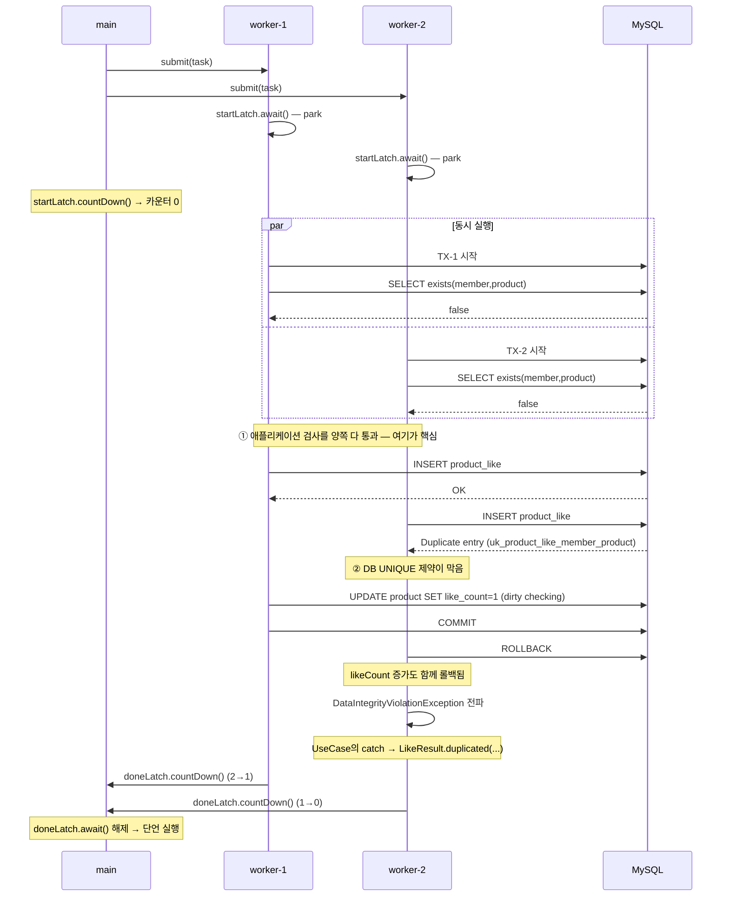

# 동시성 테스트 읽는 법 — `CountDownLatch` / `ExecutorService`

> **대상 코드**: `apps/commerce-api/src/test/java/com/loopers/application/productlike/ProductLikeUseCaseTest.java`
> → `ConcurrentLike#keepsSingleLike_whenSameMemberLikesConcurrently()`
>
> **검증 대상 결정**: ProductLike-006 (동시 요청의 UNIQUE 제약 위반을 멱등 성공으로 변환)

---

## 0. 왜 이 테스트가 필요한가

`ProductLikeService.like()`는 중복을 두 단계로 막는다.

```java
if (productLikeRepository.existsByMemberIdAndProductId(...)) {   // ① 애플리케이션 검사
    return new LikeQuery(..., true);
}
...
productLikeRepository.save(ProductLike.like(...));               // ② DB UNIQUE 제약
```

**순차 요청**은 ①에서 걸린다. 1번 요청이 커밋을 끝낸 뒤 2번이 `exists`를 물으므로 `true`가 나온다.
`marksAsDuplicatedAndKeepsLikeCount_whenLikedTwice`가 이 경로를 검증한다.

**동시 요청**은 ①이 뚫린다. 둘 다 아직 커밋 전이라 양쪽 `exists`가 모두 `false`를 받는다.
그래서 둘 다 ②로 진입하고, 한쪽이 UNIQUE 제약 위반으로 실패한다. 이 경로는 순차 테스트로는
**절대 재현되지 않는다** — `save()` 근처도 가지 않기 때문이다.

이 테스트의 목적은 **①이 뚫리는 상황을 인위적으로 만드는 것**이다.

---

## 1. 어려운 이유 — 스레드는 마음대로 겹쳐주지 않는다

```java
executor.submit(taskA);
executor.submit(taskB);
```

`submit()`은 **논블로킹**이다. 태스크를 큐에 넣고 즉시 `Future`를 반환할 뿐,
워커 스레드가 언제 그것을 꺼내 실행할지는 OS 스케줄러가 정한다.

그냥 두면 이런 일이 흔하다.

```
시간 ──────────────────────────────────────────────►
main    submit(A)   submit(B)
worker1     ├─ A 시작 ─ exists=false ─ INSERT ─ commit ─┤
worker2                                    └─ B 시작 ─ exists=TRUE ─ 조기반환
                                                        ▲
                                          A가 이미 끝나서 겹치지 않음 → ① 경로
```

이러면 순차 테스트와 똑같은 것을 검증하게 된다. **두 스레드를 출발선에 세워두고
동시에 풀어줘야** ① 구간이 겹친다.

---

## 2. `CountDownLatch`의 기술적 동작

`java.util.concurrent.CountDownLatch`는 **정수 카운터 하나를 가진 일회용 게이트**다.
내부적으로 `AbstractQueuedSynchronizer`(AQS)의 공유 모드로 구현되어 있다.

| 메서드 | 동작 |
|---|---|
| `new CountDownLatch(n)` | 카운터를 `n`으로 초기화 |
| `await()` | 카운터가 **0이 될 때까지** 호출한 스레드를 블록(`LockSupport.park`). 이미 0이면 즉시 반환 |
| `await(t, unit)` | 위와 같되 `t` 시간이 지나면 포기하고 `false` 반환 |
| `countDown()` | 카운터를 1 감소. **0이 되는 순간 대기 중인 모든 스레드를 한꺼번에 깨움** |

핵심 성질 두 가지:

- **카운터는 되돌릴 수 없다.** 0이 되면 그 이후 `await()`는 전부 즉시 통과한다.
  재사용이 필요하면 `CyclicBarrier`를 쓴다.
- **`countDown()`은 블록하지 않는다.** 카운터만 줄이고 바로 다음 줄로 넘어간다.

테스트는 이 게이트를 **두 개** 쓴다. 방향이 정반대다.

```
startLatch(1)  :  main 이 countDown  →  worker 들이 await   (출발 신호)
doneLatch(2)   :  worker 들이 countDown  →  main 이 await   (완료 대기)
```

---

## 3. 코드 한 줄씩

```java
int concurrentRequestCount = 2;
List<Throwable> failures = Collections.synchronizedList(new ArrayList<>());
CountDownLatch startLatch = new CountDownLatch(1);                 // 카운터 1
CountDownLatch doneLatch  = new CountDownLatch(concurrentRequestCount);  // 카운터 2
ExecutorService executor  = Executors.newFixedThreadPool(concurrentRequestCount);

for (int i = 0; i < concurrentRequestCount; i++) {
    executor.submit(() -> {
        try {
            startLatch.await();              // (A) 여기서 멈춘다
            productLikeUseCase.like(info);   // (B) 총성 후 동시 실행
        } catch (Throwable t) {
            failures.add(t);                 // (C) 예외를 직접 수집
        } finally {
            doneLatch.countDown();           // (D) 2 → 1 → 0
        }
    });
}
startLatch.countDown();                      // (E) 총성. 0이 되며 둘 다 깨어남
doneLatch.await(10, TimeUnit.SECONDS);       // (F) 둘 다 끝날 때까지 main 이 대기
executor.shutdown();
```

### (A)+(E) 출발선 — `startLatch`

`submit()`된 워커는 `like()`를 바로 호출하지 않고 `startLatch.await()`에서 **park 된다**.
두 워커가 모두 park 된 뒤 main 이 `countDown()`을 호출하면 카운터가 `1 → 0`이 되고,
AQS가 대기 큐의 **모든** 스레드를 동시에 unpark 한다.

`newFixedThreadPool(2)`로 스레드를 2개 확보한 것도 이것과 맞물린다. 풀 크기가 1이면
워커 하나가 `await()`에서 park 된 채 점유해버려 두 번째 태스크가 큐에서 영원히 대기한다
(→ `doneLatch.await(10초)` 타임아웃).

### (D)+(F) 결승선 — `doneLatch`

`doneLatch.await()`가 없으면 main 스레드는 `submit()` 직후 곧바로 단언문으로 내려간다.
워커가 아직 INSERT 중인데 `count()`를 조회해 `0`을 보고 실패한다.

`countDown()`을 `finally`에 둔 이유는, `like()`가 예외로 끝나도 카운터가 반드시 줄어야
main 이 10초를 통째로 기다리지 않기 때문이다.

### (C) 예외 수집 — `failures`

**이 부분이 가장 놓치기 쉽다.** 워커 스레드에서 던져진 예외는 `main` 스레드로 전파되지 않는다.
`submit()`이 반환한 `Future` 안에 갇히고, 아무도 `Future.get()`을 호출하지 않으면
**조용히 사라진다.**

즉 `try/catch`가 없으면 — `ProductLikeUseCase`가 `DataIntegrityViolationException`을
잡지 못해 500이 나는 상황에서도 — 테스트는 그 사실을 전혀 모른 채 통과할 수 있다.
그래서 직접 잡아 리스트에 모으고 `assertThat(failures).isEmpty()`로 확인한다.

`Collections.synchronizedList`인 이유: `ArrayList.add()`는 "배열에 쓰기 + size 증가"가
원자적이지 않아, 두 스레드가 동시에 호출하면 원소가 유실되거나 `ArrayIndexOutOfBoundsException`이 난다.

---

## 4. 실제로 벌어지는 일

트랜잭션은 **스레드에 묶인다**(`TransactionSynchronizationManager`가 `ThreadLocal`로 보관).
그래서 worker-1의 미커밋 INSERT는 worker-2에게 보이지 않는다. 이것이 ①이 뚫리는 근본 이유다.



### 래치 카운터 변화

```
                     startLatch   doneLatch
초기                      1           2
worker 2개 park 진입       1           2
main.countDown()          0           2     ← 둘 다 깨어남
worker-1 종료             0           1
worker-2 종료             0           0     ← main 의 await() 해제
```

---

## 5. 각 장치를 빼면 무엇이 깨지는가

| 뺀 것 | 증상 |
|---|---|
| `startLatch` | 워커가 순차 실행될 수 있음 → ①에서 걸려 **경합이 재현되지 않음**. 테스트는 통과하지만 아무것도 검증 못 함 |
| `doneLatch` | main 이 워커보다 먼저 단언 도달 → `count()`가 `0`이라 **간헐적 실패** |
| `try/catch` + `failures` | 워커의 예외가 `Future`에 갇혀 사라짐 → **버그가 있어도 통과** |
| `synchronizedList` | 동시 `add`로 예외 유실 또는 `ArrayIndexOutOfBoundsException` |
| 풀 크기를 1로 | 첫 워커가 `await()`에서 점유 → 두 번째 태스크가 실행 안 됨 → **10초 타임아웃** |

---

## 6. 이 테스트가 진짜 동작하는지 확인하는 법

동시성 테스트는 **아무것도 검증하지 못하면서 초록불**이 되기 쉽다.
그래서 뮤테이션으로 한 번 확인해야 한다.

```java
// ProductLikeUseCase.like() 의 catch 블록을 일시적으로 무력화
} catch (DataIntegrityViolationException e) {
    throw e;   // ← 원래는 LikeResult.duplicated(...)
}
```

이 상태에서 테스트를 돌려 **빨간불이 나오면** 경합이 실제로 발생하고 있다는 뜻이다.
(2026-08-25 확인: 3회 실행 모두 실패 → 원복 후 통과)

초록불이 그대로면 경합이 재현되지 않는 것이므로 스레드 수를 늘리거나 래치 구성을 점검해야 한다.

---

## 7. 알려진 한계

- **스레드 2개는 최소 구성**이다. 이 환경에서는 충돌이 재현되지만, CPU 코어 수나 부하가 다른
  CI에서는 겹치지 않을 수 있다. 일반적으로는 10~100개를 쓴다.
- **비결정적**이라 간헐적 실패(flaky) 위험이 상존한다.
- 실제 MySQL(Testcontainers)을 쓰므로 **느리다**.
- `@Transactional`을 테스트에 붙이면 안 된다. 롤백 전용 트랜잭션이 워커 스레드로 전파되지 않아
  의미가 사라진다. 이 테스트는 `@AfterEach`의 `databaseCleanUp.truncateAllTables()`로 정리한다.

## 8. 흔한 변형

`Future.get()`을 쓰면 예외가 `ExecutionException`으로 자동 전파되어
`failures`와 `doneLatch`를 없앨 수 있다.

```java
List<Future<?>> futures = new ArrayList<>();
for (int i = 0; i < concurrentRequestCount; i++) {
    futures.add(executor.submit(() -> {
        startLatch.await();
        return productLikeUseCase.like(info);
    }));
}
startLatch.countDown();
for (Future<?> f : futures) {
    f.get();   // 워커에서 터진 예외가 여기서 나옴 (동시에 완료 대기 역할도 함)
}
```

`startLatch` 대신 `CyclicBarrier(n)`를 써서 "n개가 모두 도착하면 함께 출발"로 표현하기도 한다.
