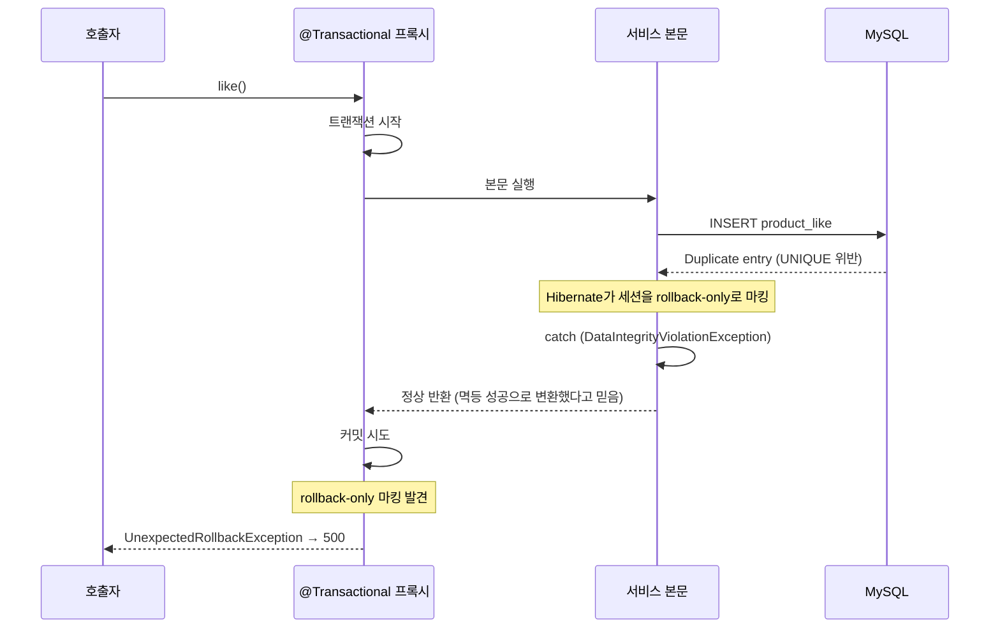

# 트랜잭션 경계와 예외 변환 — `*Processor`가 필요한 이유

> **대상 코드**: `application/productlike/ProductLikeUseCase.java`, `ProductLikeProcessor.java`
> **관련 결정**: Product-003(좋아요 수 캐시), ProductLike-006(UNIQUE 위반을 멱등 성공으로 변환)
> **관련 규칙**: `architecture-rules` — 도메인 서비스 간 호출 금지, `*Processor` 명명

---

## 0. 한 줄 요약

**트랜잭션 안에서 잡을 수 없는 예외를 밖에서 변환해야 하는데, 같은 클래스가 트랜잭션 경계이면서
동시에 그 밖일 수는 없다.** 그래서 진입점(`*UseCase`)과 트랜잭션 경계(`*Processor`)를 나눴다.

이 문서는 그 결론에 이르기까지 무엇을 검토하고 왜 버렸는지를 남긴다.

---

## 1. 문제 — 세 요구가 서로 충돌한다

좋아요 등록 하나에 세 가지 제약이 동시에 걸린다.

| # | 요구 | 출처 |
|---|---|---|
| ① | `ProductLike` 저장과 `Product.likeCount` 증가는 **같은 트랜잭션** | Product-003 |
| ② | 도메인 서비스는 서로를 모른다 → **UseCase가 조합** → 트랜잭션이 UseCase로 | `architecture-rules` |
| ③ | UNIQUE 위반 예외는 트랜잭션 **밖**에서 잡아야 한다 | Hibernate 동작 |

②는 트랜잭션을 UseCase에 두라고 하고, ③은 트랜잭션 밖을 요구한다.
**한 클래스가 둘 다 할 수 없다.**

①이 없다면 도메인 서비스마다 트랜잭션을 따로 두면 되고,
②가 없다면 도메인 서비스가 다른 도메인을 직접 불러 해결할 수 있고,
③이 없다면 UseCase에 `@Transactional`만 붙이면 끝난다. 셋이 함께라서 생기는 문제다.

---

## 2. 왜 같은 트랜잭션 안에서 못 잡는가

Hibernate는 제약 위반 같은 영속성 예외가 나면 **현재 세션을 rollback-only로 마킹한다.**
예외를 잡아 정상 반환해도 마킹은 남아 있고, 커밋 시점에 `UnexpectedRollbackException`이 터진다.



즉 **"잡았지만 소용없다".** 예외를 잡는 코드가 트랜잭션 경계 바깥에 있어야만 의미가 있다.

> 부수 효과로 정합성은 저절로 맞는다. 위반 시 트랜잭션 전체가 롤백되므로 `likeCount`도 증가하지 않는다.
> ProductLike-006이 요구하는 "카운트는 증가시키지 않는다"가 별도 코드 없이 성립한다.

---

## 3. 검토했다 버린 안

### 3.1. `exists` 선검사만으로 막기

> "먼저 조회해서 좋아요가 있으면 끝내고, 없으면 insert하면 되지 않나?"

이미 그렇게 하고 있고, **순차 요청은 이걸로 완전히 해결된다.** 문제는 동시 요청이다.

```
시간 ────────────────────────────────────────────►
스레드1  exists=false ─── INSERT ─── commit
스레드2  exists=false ────────── INSERT (실패)
         ▲
         스레드1이 아직 커밋 전이라 스레드2에게 안 보임
```

트랜잭션은 스레드에 묶이므로(`TransactionSynchronizationManager`의 `ThreadLocal`),
스레드1의 미커밋 INSERT는 스레드2에게 보이지 않는다. 양쪽 `exists`가 모두 `false`를 받고 둘 다 통과한다.

**추측이 아니라 실측했다.** `catch`를 `throw e`로 무력화하고 동시성 테스트를 돌리니 **3회 모두 실패**했다.
선검사는 값싼 최적화일 뿐 안전망이 아니다. 안전망은 DB의 UNIQUE 제약이다.

### 3.2. upsert (`INSERT IGNORE`)

예외 자체를 없애는 방법. 네이티브 쿼리로 삽입하고 affected rows로 중복 여부를 판단한다.
예외가 없으니 `@Transactional`을 UseCase에 두어도 문제가 없고, 세 요구를 모두 만족한다.

버린 이유는 **JPA를 우회한다는 대가**다.

- `ProductLike.like()` 정적 팩토리를 안 거친다 → `requireNonNull` 검증과 `likedAt` 설정이 SQL로 이동
- `BaseEntity`의 `@PrePersist`가 돌지 않아 `created_at` / `updated_at`을 쿼리에서 직접 채워야 한다
- 네이티브 쿼리라 Repository 통합 테스트가 필수가 된다 (`architecture-rules` 기준)
- `INSERT IGNORE`는 MySQL 전용 문법이다

엔티티 팩토리가 지키던 계약이 등록 경로에서 사라지는 것이 결정적이었다.

> ProductLike-006의 재검토 시점이 *"사전 락 또는 upsert 방식 검토"* 를 예고하고 있으므로,
> 좋아요 트래픽이 커지면 다시 꺼내볼 선택지다.

---

## 4. 채택한 구조

진입점과 트랜잭션 경계를 두 클래스로 나눈다.

```
ProductLikeUseCase (@Component, 트랜잭션 없음)     ← 예외 변환
        │
        │  try { ... } catch (DataIntegrityViolationException)
        ▼
ProductLikeProcessor (@Component, @Transactional)  ← 트랜잭션 경계
        │
        ├─ productService.retrieve()        ON_SALE 검증
        ├─ brandService.retrieve()          브랜드 ACTIVE 검증
        ├─ productLikeService.like()        저장
        └─ productService.increaseLikeCount()
```

```java
// ProductLikeUseCase — 트랜잭션 밖이라 예외를 잡아도 안전하다
public ProductLikeUseCaseDto.LikeResult like(ProductLikeUseCaseDto.LikeInfo info) {
    try {
        return ProductLikeUseCaseDto.LikeResult.from(productLikeProcessor.like(info.toCommand()));
    } catch (DataIntegrityViolationException e) {
        return ProductLikeUseCaseDto.LikeResult.duplicated(info.memberId(), info.productId());
    }
}
```

```java
// ProductLikeProcessor — 트랜잭션 경계. 도메인 서비스끼리는 서로를 모르므로 여기서 조합한다
@Transactional
public ProductLikeServiceDto.LikeQuery like(ProductLikeServiceDto.LikeCommand command) {
    Product product = productService.retrieve(new ProductServiceDto.RetrieveCommand(command.productId()));
    brandService.retrieve(new BrandServiceDto.RetrieveCommand(product.getBrandId()));

    ProductLikeServiceDto.LikeQuery query = productLikeService.like(command);

    if (!query.duplicated()) {
        productService.increaseLikeCount(new ProductServiceDto.LikeCountCommand(command.productId()));
    }
    return query;
}
```

`Processor`의 트랜잭션이 롤백을 끝낸 **뒤에** 예외가 `UseCase`까지 올라오므로,
그 시점에는 잡아서 정상 응답으로 바꿔도 커밋할 트랜잭션이 남아 있지 않다.

### 좋아요 취소(UC-2)는?

같은 `Processor`를 거치지만 **잡을 예외가 없다.** 삭제는 UNIQUE 제약과 무관하고,
좋아요가 없으면 삭제 없이 멱등 성공이다. 그래서 `UseCase.unlike()`는 위임만 한다.

취소는 상품·브랜드 상태도 검사하지 않는다 (ProductLike-007 — 취소는 상태와 무관하게 동작해야 한다).

---

## 5. `*Processor`를 언제 만들고, 언제 만들지 않는가

**만든다** — 아래를 모두 만족할 때만.

1. 여러 도메인 서비스를 한 트랜잭션으로 묶어야 하고
2. 그 트랜잭션 안에서 **잡을 수 없는 예외**(DB 제약 위반 등)를 밖에서 변환해야 한다

**만들지 않는다** — 그 외 전부. 기본은 `*UseCase`에 `@Transactional`을 붙이는 것이다.

이유 없이 만들면 위임만 하는 계층이 하나 늘어 흐름을 좇기 어려워진다.
`ProductLikeUseCase.unlike()`가 `Processor`를 거치는 것은 예외 처리가 필요해서가 아니라
`like()`와 구조를 맞추기 위해서다 — 취소만 있는 도메인이라면 `UseCase`에 `@Transactional`이면 충분하다.

### 왜 이름이 `*Processor`인가

`architecture-rules`의 `application` 레이어에는 `*UseCase` / `*UseCaseDto` **두 종류만** 정의돼 있었다.
새 종류의 클래스라 이름이 그대로 선례가 되므로, 세 후보를 놓고 골랐다.

| 후보 | 버린 이유 |
|---|---|
| `*Transaction` | 역할은 가장 직접적으로 드러난다("이 클래스의 존재 이유는 트랜잭션 경계다"). 다만 클래스명이 순수 기술 용어라 도메인 언어와 멀어진다 |
| `*Orchestrator` | `architecture-rules`의 *"유스케이스 오케스트레이션"* 표현과 직결된다. 하지만 `*UseCase`도 흐름을 조율하는 것처럼 읽혀 **둘의 경계가 오히려 모호해진다** |
| **`*Processor`** ✅ | 트랜잭션 안에서 **실제 처리를 수행하는 쪽**임을 드러내면서 `*UseCase`와 헷갈리지 않는다. `like` / `unlike` 양쪽을 담기에 충분히 중립적이다 |

정리하면 두 클래스의 역할 분담이 이름에 드러나야 했다.

- `*UseCase` — **진입점**. 트랜잭션 밖에서 예외를 응답으로 번역한다
- `*Processor` — **처리 본체**. 트랜잭션 안에서 도메인 서비스를 조합한다

`*Transaction`은 앞의 역할을, `*Orchestrator`는 뒤의 역할을 각각 흐리게 만든다.

> 이 명명 규칙은 `architecture-rules`의 `application.{도메인}` 절에 반영해 두었다.

---

## 6. 이 구조가 실제로 동작하는지 확인하는 법

구조가 복잡할수록 "동작한다고 믿지만 사실은 아닌" 상태가 되기 쉽다. 뮤테이션으로 확인한다.

| 주입한 버그 | 기대 | 실측 |
|---|---|---|
| `UseCase`의 `catch`를 `throw e`로 | 동시성 테스트 실패 | ✅ 실패 |
| `if (!query.duplicated())` 가드 제거 | UseCase 테스트 실패 | ✅ 실패 |
| `exists` 선검사만 남기고 `catch` 제거 | 동시성 테스트 실패 | ✅ 3회 모두 실패 |

특히 세 번째가 3.1을 버린 근거다. 동시성 테스트는 아무것도 검증하지 못하면서 초록불이 되기 쉬우므로,
**경합이 실제로 재현되는지**를 뮤테이션으로 한 번은 확인해야 한다
(참고: `01_동시성테스트_CountDownLatch.md`).
